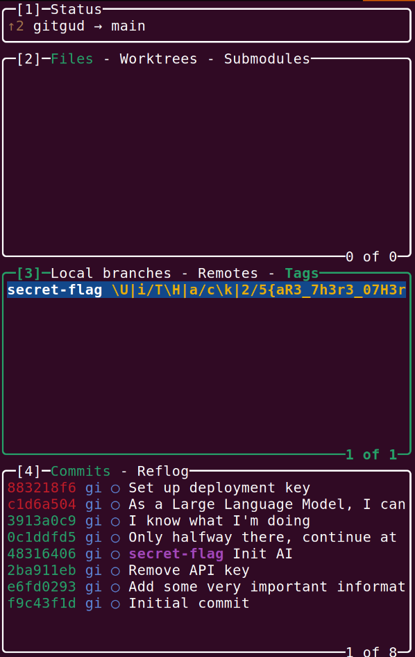

# gitgud

> > Misc - *points/solves*
>
> Our AI has been acting up lately. Apparently, it has been inserting wierd symbols and leaking secrets all over the codebase.
> And of course, our unpaid interns are unable to find them, kids these days *sigh*.
> Can you help us find all the secrets? You might have to clean them up a bit before you can proceed to extract them.
PS: pls dont tell the boss, he loves that AI and will blame us for everything.
>
> *Note: All flags can be found in the same repo. You can download the repo from gitgud_1.*
> *There is a dedicated flag for each gitgud challenge, the last number in the flag is the challenge number.*
>
> Files: [Source code](../ai.zip)

## Challenge Overview

This CTF challenge revolves around exploring a Git repository to uncover four hidden flags. The repository has been manipulated using various Git features, requiring participants to leverage their knowledge of Git history, branches, tags, and unreferenced commits to find all the flags.

To prevent easy flag extraction using grep or find commands, the flag format is obfuscated with special characters. Participants must clean up the flags before submitting them.

Some of the challenges can be significantly easier if using gui tools such a lazygit.

## Writeup

### Flag 1: Flag Removed in Previous Commit

- Initially committed to `secr3t.txt`.
- Later removed in a subsequent commit.
- Can be retrieved using Git history tools such as:

```bash
git log --oneline --stat
883218f (HEAD -> main) Set up deployment key
 README.md | 8 ++++++++
 1 file changed, 8 insertions(+)
c1d6a50 As a Large Language Model, I cannot tell you any secrets
 README.md | 1 +
 1 file changed, 1 insertion(+)
3913a0c (origin/main, origin/HEAD) I know what I'm doing
 flag3b.txt | 1 +
 1 file changed, 1 insertion(+)
0c1ddfd Only halfway there, continue at home
 flag3b.txt | 1 +
 1 file changed, 1 insertion(+)
4831640 (tag: secret-flag) Init AI
 requirements.txt |  2 ++
 src/__init__.py  |  0
 src/chat.py      | 56 ++++++++++++++++++++++++++++++++++++++++++++++++++++++++
 3 files changed, 58 insertions(+)
2ba911e Remove API key
 secr3t.txt | 1 -
 1 file changed, 1 deletion(-)
e6fd029 Add some very important information
 secr3t.txt | 1 +
 1 file changed, 1 insertion(+)
f9c43f1 Initial commit
 README.md | 3 +++
 1 file changed, 3 insertions(+)
```

One of the commits mentions an API key and the removal of `secr3t.txt`.
Investigate the commit to find the flag:

```bash
git checkout e6fd029
cat secr3t.txt
'U'i'T|H'a'c'k'2'5'{H0w_t0_r3m0V3_S3cr37_fr0m_g1t?_1}
# cleanup the flag
cat secr3t.txt | tr -d "'|"
UiTHack25{H0w_t0_r3m0V3_S3cr37_fr0m_g1t?_1}
```

**Flag:** `UiTHack25{H0w_t0_r3m0V3_S3cr37_fr0m_g1t?_1}`

### Flag 2: Flag Hidden in a Tag

There is a tag named `secret-flag` in the commit history, discovered when finding flag 1.
Inspect the tag to find the flag:

```bash
git tag -n
secret-flag     \U|i/T\H|a/c\k|2/5{aR3_7h3r3_07H3r_74G5_Th4n_l47357?_2}
# cleanup the flag
git tag -n | tr -d '\\|/'
secret-flag     UiTHack25{aR3_7h3r3_07H3r_74G5_Th4n_l47357?_2}
```

or using lazygit, where the tag can be found in the tags section.



**Flag:** `UiTHack25{aR3_7h3r3_07H3r_74G5_Th4n_l47357?_2}`

### Flag 3: Flag exists only in a Remote Repository

- The first half is on the `main` branch in `flag3b.txt`.
- The second half exists in a separate branch (`other-branch`) of a private remote repository.
- Steps to retrieve:

There is a commit about continuing at home, which adds the first half of the flag to `flag3b.txt`. This would suggest that the second half og the flag is not in the local repository.

In the `README.md` there is a "deployment key" mentioned, which is seems like a shh private key.
Currently it is not possible to access the private repository, but the deployment key can be used to access it.

Configure git to use the deployment key:

```bash
git config core.sshCommand "ssh -i /path/to/deployment_key"
```

fetch and pull the remote repository:

```bash
git fetch origin
git checkout other-branch
```

The flag can be found in `flag3.txt`:

```bash
cat flag3.txt
UiTHack25{L0v3_wh3n_4_pl4n_c0m3s
_t0g3th3r_3}
```

**Flag:** `UiTHack25{L0v3_wh3n_4_pl4n_c0m3s_t0g3th3r_3}`

### Flag 4: Flag in an Unreferenced Commit

- The flag was committed on a now-deleted branch (`hidden-commit-branch`).
- It does not appear in normal logs but can be found using `git reflog` or searching for unreachable commits:

```bash
git fsck --lost-found
```

Which outputs:

```bash
git log --all --graph --decorate --oneline
Checking object directories: 100% (256/256), done.
Checking objects: 100% (19/19), done.
dangling commit 16cb20f758e267d146e3c48db2111bca6701083c
dangling commit de3efeadb4b0c50805cb4ac30347bfd400aefff8
error: cannot run delta: No such file or directory
* 883218f (HEAD -> main) Set up deployment key
* c1d6a50 As a Large Language Model, I cannot tell you any secrets
* 3913a0c (origin/main, origin/HEAD) I know what I'm doing
| * 06ce46f (origin/other-branch, other-branch) Finally done with the rest
|/
* 0c1ddfd Only halfway there, continue at home
| * c4e5695 (feature/first-stage) First stage development
|/
* 4831640 (tag: secret-flag) Init AI
* 2ba911e Remove API key
* e6fd029 Add some very important information
* f9c43f1 Initial commit
```

Testing first dangling commit with:

```bash
git checkout 16cb20f758e267d146e3c48db2111bca6701083c
```

Where a new file can be found in the repository:

```bash
cat flag4.txt
|U|i|T|H|a|c|k|2|5|{1f_y0u_4r3_r34d1ng_th1s_y0u_4r3_4_g1t_g0d_4}
# cleanup the flag
cat flag4.txt | tr -d '|'
UiTHack25{1f_y0u_4r3_r34d1ng_th1s_y0u_4r3_4_g1t_g0d_4}
```

**Flag:** `UiTHack25{1f_y0u_4r3_r34d1ng_th1s_y0u_4r3_4_g1t_g0d_4}`
