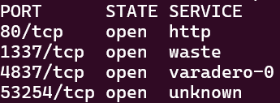

# Knock Knock

> > Misc - *points/solves*
>
>In the rain-slick alleys of San Sequestro lies an underground safehouse where the city's most wanted netrunners hide. No retinal scans, no fingerprints - just an old-school precise knock sequence on a rusted steel door grants access to those who prove themselves worthy. Can you crack the sequence and access the secrets within?
>
>Note: this challenge uses the HTTP protocol and can be done in a browser.
>

## Writeup

> Note: port 80 was moved to 10080 due to a conflict with the host machine.

This challenge is based on [port knocking](https://en.wikipedia.org/wiki/Port_knocking).

By using [nmap](https://nmap.org/) with the command `nmap -p- (hostname)` we can discover the open ports of this service:



By connecting to the different ports using HTTP (ex. <http://hostname:4837>) we discover that port 4837 gives us a useful message, directing us to the next port. After connecting to ports 4837, 53254 and 1337 (in that order) in under 5 seconds, we can go back to port 80 where we are presented with the flag.

The user may alternatively purchase the first port as a hint, which will direct them through the challenge without having to enumerate the ports of the host.

Flag:

```txt
UiTHack25{Wh05_Th3r3?_N0t_Th3_f3d5}
```

## Resources

Port knocking: <https://en.wikipedia.org/wiki/Port_knocking>

Nmap: <https://nmap.org/>
